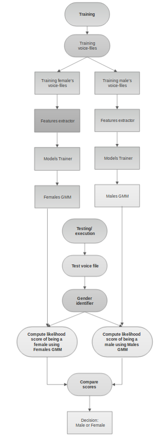

[](http://hits.dwyl.io/SuperKogito/Voice-based-gender-recognition)

# Voice-based-gender-recognition
Voice based gender recognition using Mel-frequency cepstrum coefficients (MFCC)  and Gaussian mixture models (GMM).

## Theory

#### Voice features extraction
The Mel-Frequency Cepstrum Coefficients (MFCC) are used here, since they deliver the best results in speaker verification.
MFCCs are commonly derived as follows:
1. Take the Fourier transform of (a windowed excerpt of) a signal.
2. Map the powers of the spectrum obtained above onto the mel scale, using triangular overlapping windows.
3. Take the logs of the powers at each of the mel frequencies.
4. Take the discrete cosine transform of the list of mel log powers, as if it were a signal.
5. The MFCCs are the amplitudes of the resulting spectrum.

#### Gaussian Mixture Model
According to D. Reynolds in [Gaussian_Mixture_Models](https://pdfs.semanticscholar.org/734b/07b53c23f74a3b004d7fe341ae4fce462fc6.pdf):
A Gaussian Mixture Model (GMM) is a parametric probability density function represented as a weighted sum of Gaussian component densities. GMMs are commonly used as a parametric model of the probability distribution of continuous measurements or features in a biometric system, such as vocal-tract related spectral features in a speaker recognition system. GMM parameters are estimated from training data using the iterative Expectation-Maximization (EM) algorithm or Maximum A Posteriori(MAP) estimation from a well-trained prior model.

#### Workflow graph


## Dependencies
This script require the follwing modules/libraries: 
* [numpy](http://www.numpy.org/) & [scipy](https://www.scipy.org/) & [scikit-learn](https://scikit-learn.org/stable/) & [python_speech_features](https://github.com/jameslyons/python_speech_features)

Libs can be installed as follows:
```
pip install (insert lib-name)
```
