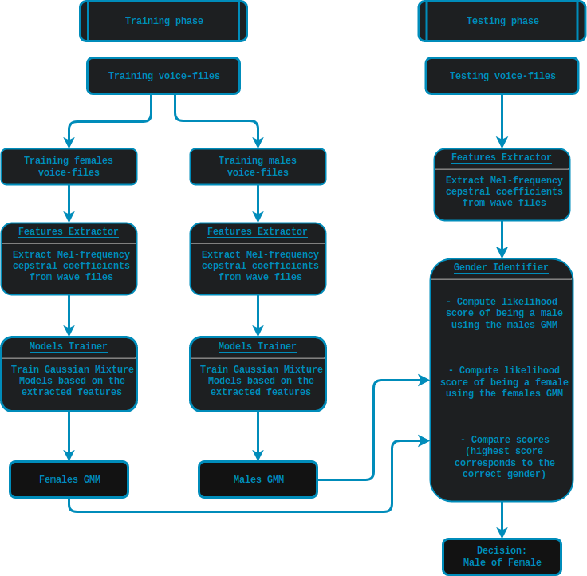

[](https://travis-ci.com/SuperKogito/Voice-based-gender-recognition)

# Voice-based-gender-recognition
Voice based gender recognition using:
  - **The Free ST American English Corpus dataset (SLR45)**
  - **Mel-frequency cepstrum coefficients (MFCC)**
  - **Gaussian mixture models (GMM)**
## Dataset
The  **The Free ST American English Corpus dataset (SLR45)**  can be found on [SLR45](http://www.openslr.org/45/). It is a free American English corpus by [Surfingtech](www.surfing.ai), containing utterances from 10 speakers (5 females and 5 males). Each speaker has about 350 utterances.

## Theory

#### Voice features extraction
The Mel-Frequency Cepstrum Coefficients (MFCC) are used here, since they deliver the best results in speaker verification.
MFCCs are commonly derived as follows:
1. Take the Fourier transform of (a windowed excerpt of) a signal.
2. Map the powers of the spectrum obtained above onto the mel scale, using triangular overlapping windows.
3. Take the logs of the powers at each of the mel frequencies.
4. Take the discrete cosine transform of the list of mel log powers, as if it were a signal.
5. The MFCCs are the amplitudes of the resulting spectrum.

#### Gaussian Mixture Model
According to D. Reynolds in [Gaussian_Mixture_Models](https://pdfs.semanticscholar.org/734b/07b53c23f74a3b004d7fe341ae4fce462fc6.pdf):
A Gaussian Mixture Model (GMM) is a parametric probability density function represented as a weighted sum of Gaussian component densities. GMMs are commonly used as a parametric model of the probability distribution of continuous measurements or features in a biometric system, such as vocal-tract related spectral features in a speaker recognition system. GMM parameters are estimated from training data using the iterative Expectation-Maximization (EM) algorithm or Maximum A Posteriori(MAP) estimation from a well-trained prior model.

#### Workflow graph
<p align="center">
  
</p>

---------------  
- #### For a more detailed explanation, please refer to this [blog](https://superkogito.github.io/blog/VoiceBasedGenderRecognition.html) that I have written.
-----------------

## Dependencies
This script require the follwing modules/libraries:
* [numpy](http://www.numpy.org/) & [scipy](https://www.scipy.org/) & [scikit-learn](https://scikit-learn.org/stable/) & [python_speech_features](https://github.com/jameslyons/python_speech_features)

Libs can be installed as follows:
```
pip install -r requirements.txt
```
## Code & scripts
- [Run.py](Run.py) : This is the main script and it will run the whole cycle (Data management > Models training > Genders identification)
- [DataManager.py](Code/DataManager.py): This script is responsible for the extracting and strcturing the data.
- [ModelsTrainer.py](Code/ModelsTrainer.py):This script is responsible for training the Gaussian Mixture Models (GMM).
- [GenderIdentifier.py](Code/GenderIdentifier.py):This script is responsible for Testing the system by identifying the genders of the testing set.
- [FeaturesExtractor.py](Code/FeaturesExtractor.py):This script is responsible for extracting the MFCC features from the .wav files.

## Results and disscussion
- The system results in a **95%** accuracy of gender detection.
- The code can be further optimized using multi-threading, acceleration libs and multi-processing.
- The accuracy can be further improved using GMM normalization aka a UBM-GMM system.
